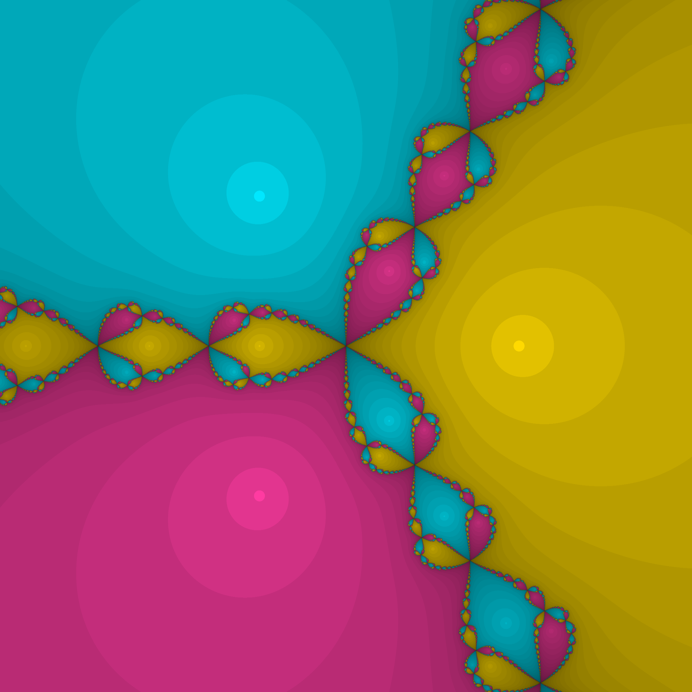

# 🌌 Newton Fractal Explorer: 4K Generative Art


> **"Where Calculus 1 meets Creative Coding."**
> A high-performance Python workspace to visualize the chaotic beauty of Newton's Method convergence on the complex plane.

<p align="center">
  
</p>

---

## 🧐 About The Project

As a Computer Science undergraduate studying **Calculus 1**, I wanted to move beyond solving derivatives on paper. I wanted to *see* the mathematics.

This project implements the **Newton-Raphson Method** to find the roots of the polynomial $f(z) = z^3 - 1$. Instead of calculating single points, it processes **8+ million pixels simultaneously** using Python and NumPy to generate a high-resolution fractal map of the convergence speed.

### 🌟 Key Features
* **🚀 Pure Vectorization:** Zero `for` loops in the core logic. Uses NumPy broadcasting to process the entire 4K grid in parallel ($O(1)$ Python overhead).
* **🎨 Generative Art:** Implements **Depth Shading** (logarithmic normalization) to visualize iteration counts as 3D depth.
* **🖥️ 4K Ultra HD:** Renders crystal-clear images at 3840x2160 resolution (300 DPI).
* **Math-First:** Accurate implementation of complex number operations and derivative calculus.

---

## 📐 The Mathematics

The script solves for the roots of the complex function:

$$f(z) = z^3 - 1$$

Using the iterative **Newton's Formula**:

$$z_{n+1} = z_n - \frac{z_n^3 - 1}{3z_n^2}$$

The algorithm classifies every pixel on the complex plane based on which of the three roots it converges to:
1.  **$z_1 = 1$** (Real Root) → 🟡 **Gold**
2.  **$z_2 = e^{i\frac{2\pi}{3}}$** → 🔵 **Cyan**
3.  **$z_3 = e^{i\frac{4\pi}{3}}$** → 🔴 **Magenta**

---

## 💻 Tech Stack & Implementation

The core power lies in **Vectorization**. Instead of iterating pixel by pixel (which is slow in Python), we operate on matrices.

```python
# 1. Create the Complex Grid (Vectorized)
X, Y = np.meshgrid(x, y)
Z = X + 1j * Y

# 2. Newton Iteration applied to ALL pixels at once
# No loops used here!
f_z = Z**3 - 1
f_prime_z = 3 * Z**2
Z_new = Z - f_z / f_prime_z
